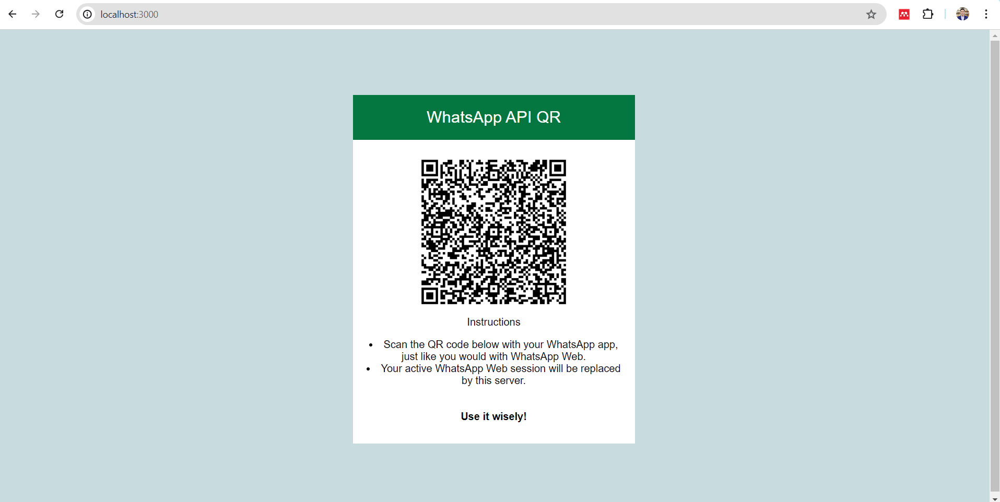
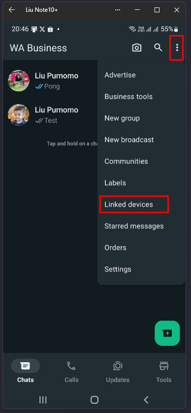
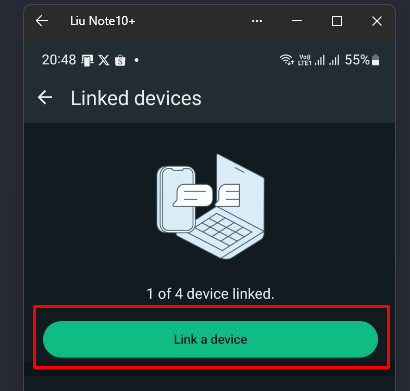
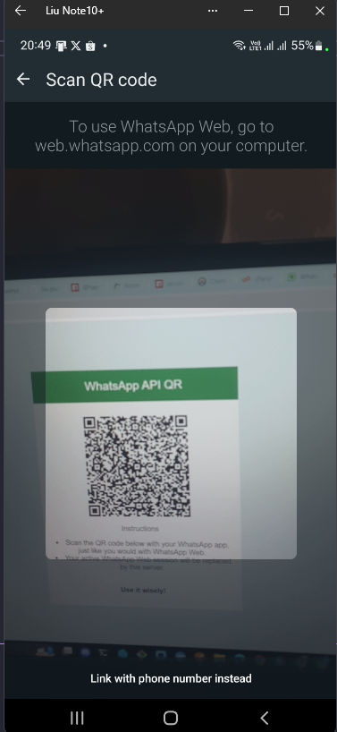
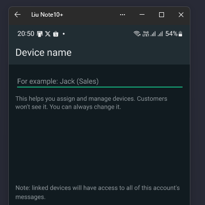
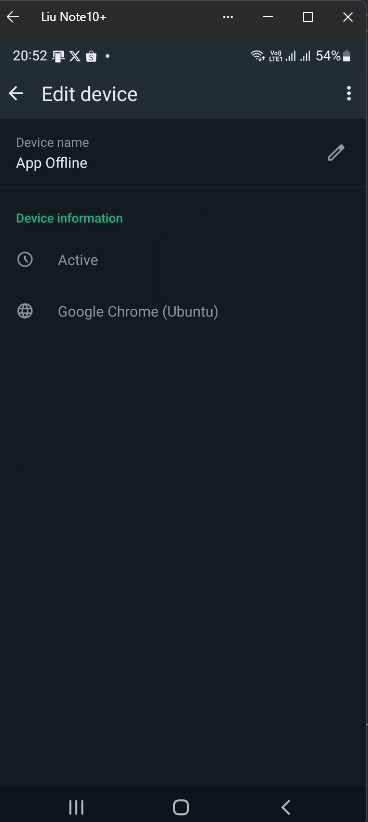
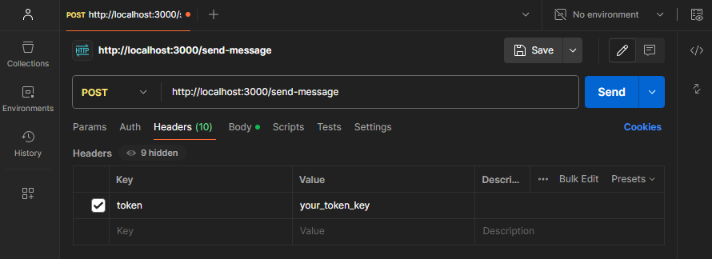
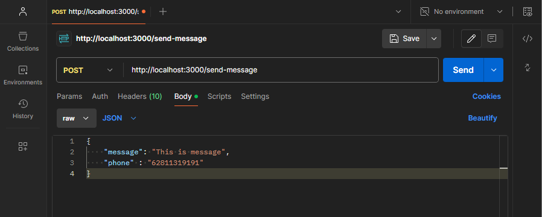
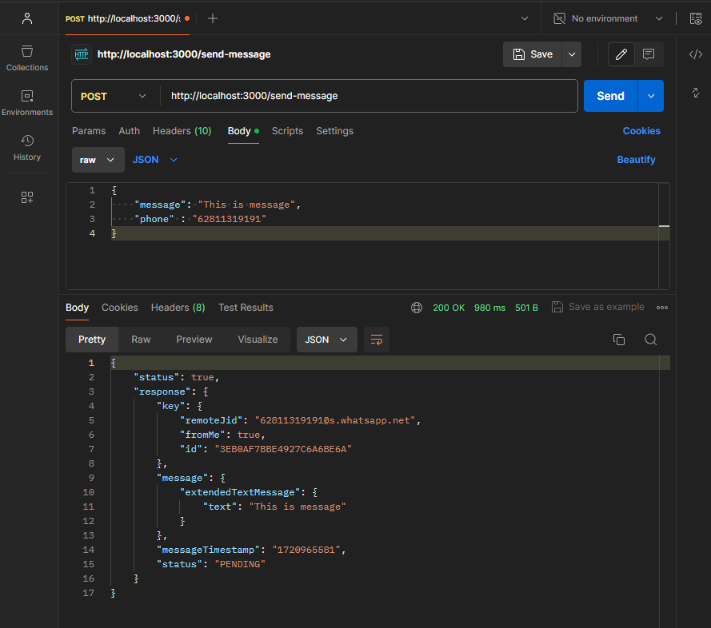

# WhatsApp API

This is a simple REST API for WhatsApp. It is built using Node.js Express

## Installation

Clone the repository

```bash
git clone https://github.com/liupurnomo/whatsapp-api.git
```
Enter the folder

```bash
cd whatsapp-api
```
Install the dependencies

```bash
npm install
```

## Set Environment Variable

Open `.env` file and set the environment variable

```bash
cp .env.example .env
```

Set the environment variable

```markdown
TOKEN_KEY=your_token_key
PORT=3000
```

## Run the server

```bash
npm run start
```
You will see the following message

```bash
Server is running on port 3000
```

## Link your whatsapp to the server

Open browser and go to `http://localhost:3000`

You will see page like this



Now open your whatsapp on mobile phone, click linked devices



Than click link a device



Scan QR code from your computer



Set device name to your device name



If you see this screen, the device is linked to your whatsapp



## Send Message

Open postman, and set method `POST` to `http://localhost:3000/send-message`

Set token on header



Set body, using RAW JSON type

```json
{
    "phone": "6281234567890",
    "message": "Hello, World!"
}
```

Send the request



Postman response 

